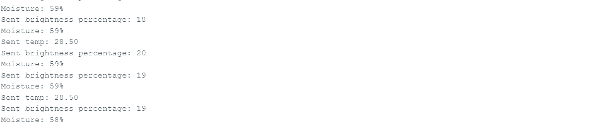
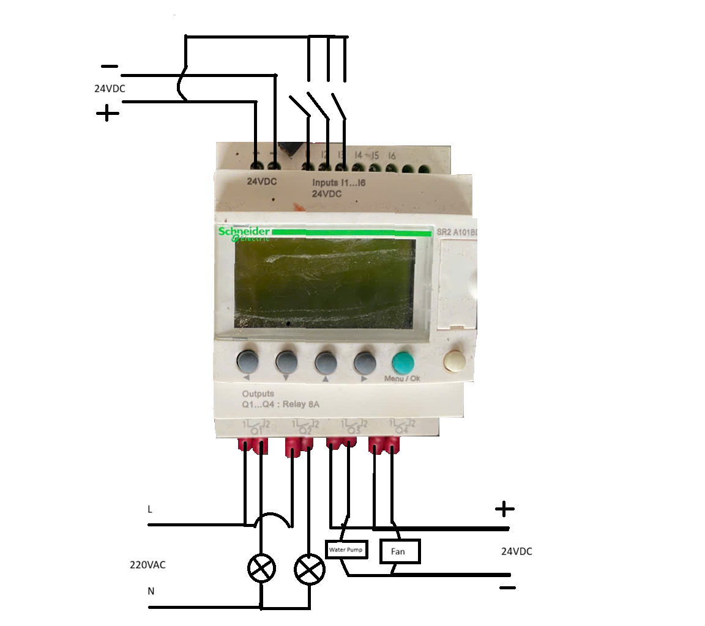
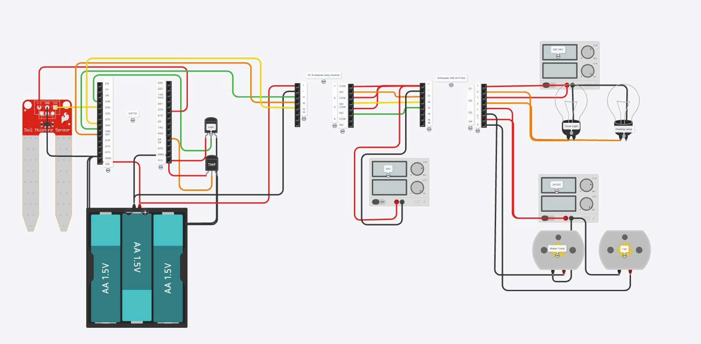
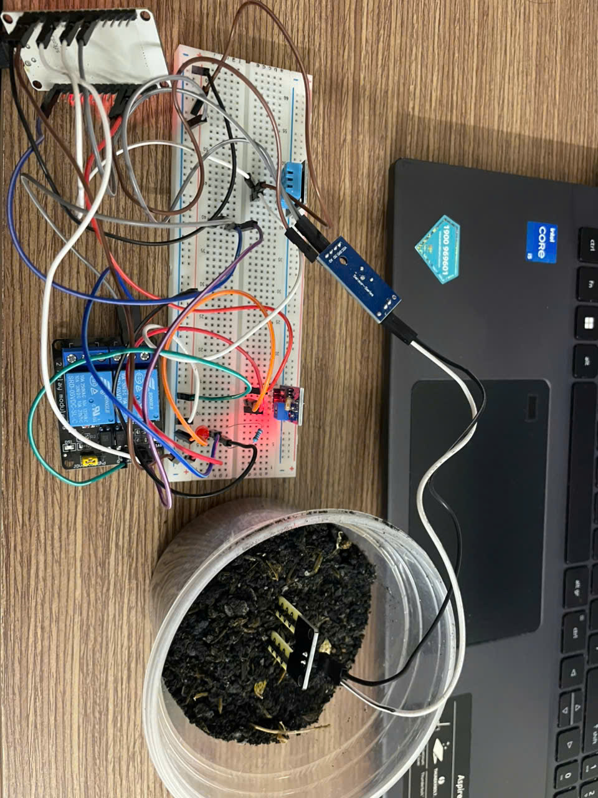

Project Overview: Describe the physical layout diagram of the cabinet, as well as showing where the ESP32, PLC, relays, and water pump are positioned to connect to the input and output devices efficiently

Build Progress: 

*The temperature, soil moisture, and lighting data that is sent from ESP32 to Arduino, a software that is designed to read inputs and turn them to outputs*

https://youtu.be/XqmHnOMMV8o

*A video showing the data that is read from the sensors being uploaded and updated on the Blynk app, which will inform the user about the conditions inside of the cabinet*

*A diagram showing the wiring to the PLC, with the assumption of inputs as switches, since they both produce HIGH and LOW signals*

*The overall wiring diagram, which shows the connections between the ESP32, relay, and PLC Schneider SR2*

*A circuit that is built on a breadboard with sensors to collect data from the surrounding, which will be repositioned inside of the cabinet later on*

