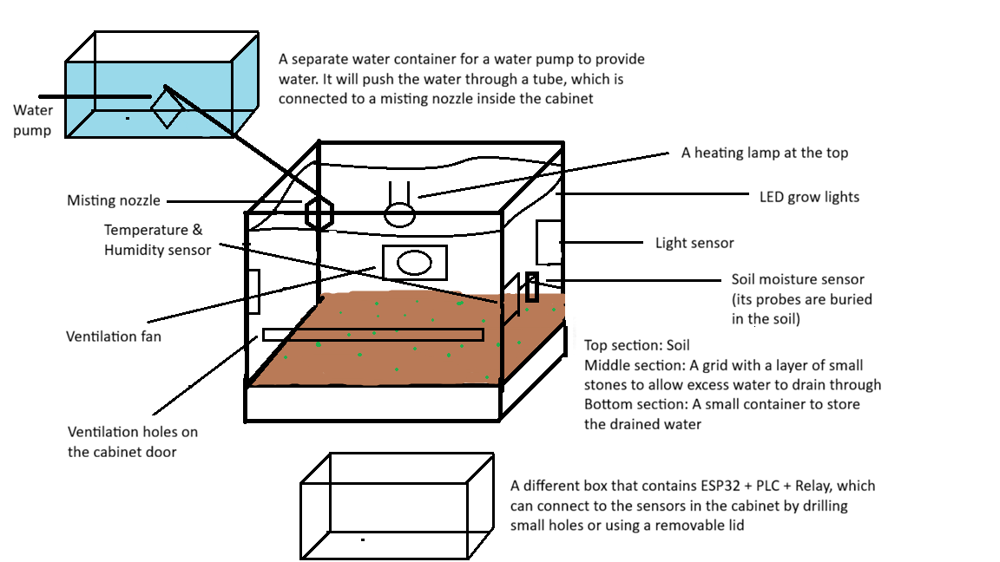

Project Overview: Describe the physical layout diagram of the cabinet, as well as showing where the ESP32, PLC, relays, and water pump are positioned to connect to the input and output devices efficiently

