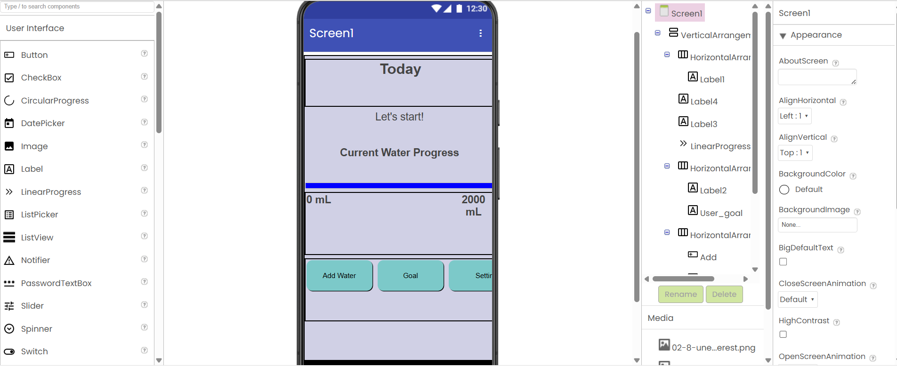

## PLC-Controlled Plant Growing Cabinet
Designed and built a self-monitoring cabinet that can grow plants in ideal conditions by controlling temperature, soil moisture, light, and humidity. It consists of an ESP32 for sensor monitoring and condition reporting to the user through Blynk, while sending signals to a PLC for time-controlled operation of a grow light, heating lamp, ventilation fan, and water pump. See the project at `/Plant_Cabinet`

## Water Reminder App
This application reminds people to drink water everyday. It allows users to input the amount of water that they take, track their progress according to their goals using the progress bar, and change their goals in the Goal section. Built with MIT App Inventor - see `/WaterReminderApp.aia`

[View all photos](https://github.com/lenamhuynh/highschool-projects/tree/main/images)

## Racing Car
Built using Arduino, electrical components such as motors, LEDs, resistors, buzzers, and reused materials. 
[View all photos](https://github.com/lenamhuynh/highschool-projects/tree/main/carimages)

## Simon Memory Game
A two-player version of the classic Simon Memory Game
**How it works:**
- Both players see the same LED pattern and must repeat it using the buttons
- Level 1 starts with a single flash, and each new level will add one more flash to the pattern
- Both players will need to complete a level correctly to advance
- A player wins if their opponent fails to repeat the pattern - but if only that player manages to do so, because if they cannot, both player fails
- Each LED has a distinct sound that plays when the player presses the button, and different songs will be played depends on the results of the game.
See the project at `/SimonMemoryGame.ino`

